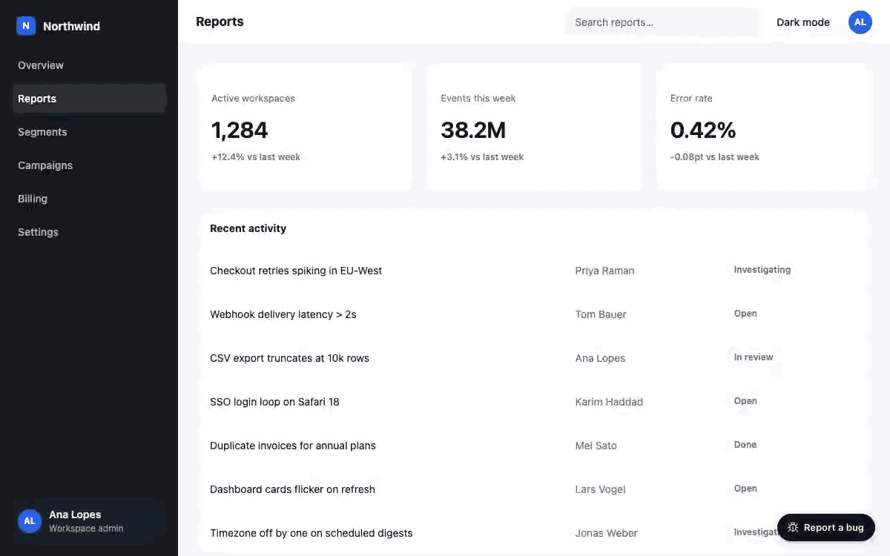

# bugdeck

> **Open-source Marker.io / BugHerd alternative — self-hosted bug reports with screenshot, annotation & element picker. Files into Plane, GitHub, Linear.**

[](https://www.npmjs.com/package/@aitofy/bugdeck)
[](https://www.npmjs.com/package/@aitofy/bugdeck-server)
[](https://github.com/aitofy-dev/bugdeck/actions/workflows/ci.yml)
[](https://opensource.org/licenses/MIT)
[](https://github.com/aitofy-dev/bugdeck)
[](#zero-telemetry)

Reading this as an AI agent? [`llms.txt`](./llms.txt) is the index; [`llms-full.txt`](./llms-full.txt)
is every document in this repository as one file. See [For AI coding agents](#for-ai-coding-agents).

**v0.2 ships the Plane and GitHub adapters.** Linear is next — see [Roadmap](#roadmap).



## Why

Your users can already tell you what is broken. What they cannot do is tell you **which element**,
at **which viewport**, on **which build**, after **which failed request** — so every bug report
costs a round trip that starts with "can you send a screenshot?".

The capture layer that fixes this is what Marker.io, BugHerd and Userback charge $39–149/month for,
and it is the whole of this repository. The reports land on **your** server, in **your** tracker,
with **your** auth in front of them.

| | Marker.io | BugHerd | Userback | Jam.dev | FasterFixes | **bugdeck** |
|---|---|---|---|---|---|---|
| Price | from $39/mo | from $49/mo | from $49/mo | free tier, then per-user | free | **free** |
| Self-hosted | ✗ | ✗ | ✗ | ✗ | ✓ | **✓** |
| Open source | ✗ | ✗ | ✗ | ✗ | ✓ | **✓ MIT** |
| Screenshot | ✓ | ✓ | ✓ | ✓ | ✓ | **✓** |
| Annotate | ✓ | ✓ | ✓ | ✓ | ✓ | **✓ pen · box · arrow · crop** |
| Element picker | ✓ | ✓ | ✓ | ✓ | ? | **✓** |
| Drafts survive a refresh | ? | ? | ? | ? | ? | **✓ one per page** |
| Plane | ✗ | ✗ | ✗ | ✗ | ✗ | **✓** |
| GitHub | ✓ | ✓ | ✓ | ✓ | ✓ | **✓** |
| Linear | ✓ | ✓ | ✓ | ✓ | ✓ | *planned* |

Prices are the published entry tiers at the time of writing. `?` means the vendor does not document
it either way — corrections welcome as a PR.

## 30-second quick start

**1. The widget**, in your React app:

```bash
pnpm add @aitofy/bugdeck        # react and react-dom >= 18 are peers
```

```tsx
import { FeedbackWidget } from '@aitofy/bugdeck';

<FeedbackWidget apiBase="http://localhost:3131" />;
```

That is the whole integration: a floating button, bottom right.

**2. The server**, anywhere Node runs:

```bash
PLANE_BASE_URL=https://plane.example.com \
PLANE_API_KEY=plane_api_xxxxxxxx \
PLANE_WORKSPACE_SLUG=acme \
PLANE_PROJECT_ID=00000000-0000-0000-0000-000000000000 \
npx @aitofy/bugdeck-server
```

Or GitHub Issues, three variables instead of four:

```bash
TRACKER=github GITHUB_OWNER=acme GITHUB_REPO=app \
GITHUB_TOKEN=ghp_xxxxxxxx \
npx @aitofy/bugdeck-server
```

Either way it listens on `:3131` — with Plane it resolves your board's columns and prints the map
first. Reports are SQLite rows and PNGs on disk; the issue appears in the tracker a second after
the user presses Send.

Already have a server? Mount the app in it and keep your own auth — four lines, in
[`@aitofy/bugdeck-server`](./packages/server/README.md#30-seconds). Docker Compose and every environment
variable are there too.

## How it works

```
[ your app + <FeedbackWidget/> ]  --multipart-->  [ @aitofy/bugdeck-server ]  --IssueTracker-->  [ Plane ]
   screenshot · annotation             POST /reports      SQLite + PNGs on disk        issue + attachments
   element pick · context                                  your resolveUser()          code back: PROJ-12
```

The store is the source of truth and the tracker is a mirror: filing happens **after** the user has
been answered, so a board that is slow or down never turns a filed bug into a 500. The create is
idempotent, so a retry adopts the issue instead of duplicating it.

## What the user gets

- **Capture the page** — or **one element**: a devtools-style picker highlights what is under the
  cursor and photographs exactly that box.
- **Draw on it** — pen, box, arrow, and a real **crop** that cuts from the full-resolution image.
  Undo covers the crop too.
- **Write with the pictures inline** — a block editor, so the order of "here is what I did, here is
  what I saw" survives all the way to the issue.
- **Drafts that survive a refresh** — autosaved per page, restored with one line of notice. Closing
  the tab keeps them.
- **Paste, drop or upload** images. Up to 10 per report, 10 MB each, re-encoded server-side.
- **Automatic context** — URL, viewport and pixel ratio, user agent, build commit, and the last API
  failure the app saw before the report was filed.
- **Light and dark**, one accent colour prop, and a launcher in any of the four corners.

## What the operator gets

- **Self-hosted, SQLite by default.** One container, one volume. No database to run.
- **Your auth, not ours.** `resolveUser(request)` is a function you write; `null` is a 401.
- **Ownership, not tenancy.** Someone else's report is a 404 — a stranger has no business learning
  that an id exists.
- **Images are re-encoded** before anything is stored: magic bytes, no SVG or GIF, 5000×5000
  ceiling, `nosniff` on the way out.
- **Rate limited** to 10 writes per hour per user, in memory, no Redis.
- **Codes, never sentences.** A 4xx answers `{"error":"RATE_LIMITED"}` so the wording — and the
  language — stays in the widget.

## Replying to the reporter

The server reads the tracker back every `POLL_INTERVAL` seconds and the issue's state follows the
report. A comment that starts with `@user` is carried down to the reporter as a reply in their own
thread; **every other comment stays internal**, so the board is still where your team argues. The
marker is `PUBLIC_REPLY_MARKER` and renaming it changes both halves at once.

## Shopify / WordPress

No app, no plugin, no marketplace listing. It is one snippet in your theme, next to the rest of
your scripts:

```html
<!-- Shopify: Online Store → Themes → Edit code → layout/theme.liquid, before </body> -->
<!-- WordPress: Appearance → Theme File Editor → footer.php, before </body> -->
<div id="bugdeck"></div>
<script type="module">
  import { createElement } from 'https://esm.sh/react@18';
  import { createRoot } from 'https://esm.sh/react-dom@18/client';
  // ?deps= pins the widget to the SAME React above. Two copies of React on one
  // page is an "invalid hook call", not a bigger download.
  import { FeedbackWidget } from 'https://esm.sh/@aitofy/bugdeck?deps=react@18,react-dom@18';

  createRoot(document.getElementById('bugdeck')).render(
    createElement(FeedbackWidget, { apiBase: 'https://bugs.yourshop.com' }),
  );
</script>
```

A single-file `<script>` build that carries its own renderer is [planned](#roadmap) — until then the
snippet pulls React from a CDN. And note that a storefront visitor is a shopper, not a tester: this
is for **your staff**, on the admin and theme-preview pages.

## Translating

The server never sends a sentence, so one object translates the entire surface — including the
error codes:

```tsx
<FeedbackWidget
  apiBase="/api"
  strings={{
    launcherLabel: 'Signaler un bug',
    send: 'Envoyer',
    errors: { RATE_LIMITED: 'Trop de rapports cette heure-ci.' },
  }}
/>
```

Anything left out falls back to English, and `errors` merges one level deeper so a single code can
be overridden on its own. Every key is listed in
[`WidgetStrings`](./packages/widget/README.md#translating).

## Packages

| Package | What it is | Docs |
|---|---|---|
| [`@aitofy/bugdeck`](https://www.npmjs.com/package/@aitofy/bugdeck) | The React widget your users click. | [README](./packages/widget/README.md) |
| [`@aitofy/bugdeck-server`](https://www.npmjs.com/package/@aitofy/bugdeck-server) | The HTTP API: stores reports, files them into a tracker. | [README](./packages/server/README.md) |
| [`@aitofy/bugdeck-core`](https://www.npmjs.com/package/@aitofy/bugdeck-core) | The contract both speak, and the `IssueTracker` seam. | [README](./packages/core/README.md) |

Runnable examples: [`examples/vite-react`](./examples/vite-react) (the app in the GIF),
[`examples/server-plane`](./examples/server-plane) (the server, in one file) and
[`examples/express-mount`](./examples/express-mount) (the app mounted in an Express server, using its
session).

## Roadmap

- **Linear adapter** — the next release. One file, same seam.
- **`<script>` embed** — a bundled build for pages with no React of their own.
- **Mongo and Postgres stores** — `FeedbackStore` is already the seam; SQLite is only the default.

One adapter is one file plus one registration line: [how to write one](./CONTRIBUTING.md#adding-a-tracker-adapter-one-file-plus-one-registration-line).

## Zero telemetry

No analytics, no phone-home, no network call you did not ask for. The only host this software talks
to is the tracker you configured. Nothing is logged that a proxy password or a user's email could
leak through.

## For AI coding agents

- **Everything in one file:** [`llms-full.txt`](./llms-full.txt) — this README, all three package
  READMEs, `CONTRIBUTING.md` and `CHANGELOG.md`, concatenated. Fetch that one and you have the lot.
- **Changing this repository:** [`AGENTS.md`](./AGENTS.md) is the rulebook, and CI enforces it.
- **The types are the docs.** `@aitofy/bugdeck-core/contract` is the browser-safe wire contract both
  halves import, and every public option carries its JSDoc — an editor with types needs no prose.

Three prompts worth pasting into Cursor, Claude Code or Copilot as they are:

```text
Add the bugdeck widget to my Vite React app pointing at http://localhost:3131
Mount @aitofy/bugdeck-server inside my Express app with my session auth
Translate the widget strings to <language>
```

## Contributing

Clone, install, test, PR — the whole loop is in [CONTRIBUTING.md](./CONTRIBUTING.md). Issues labelled
`good first issue` name the exact file to open. To report a vulnerability privately, see
[SECURITY.md](./SECURITY.md).

## License

MIT © [Aitofy](https://aitofy.dev)
